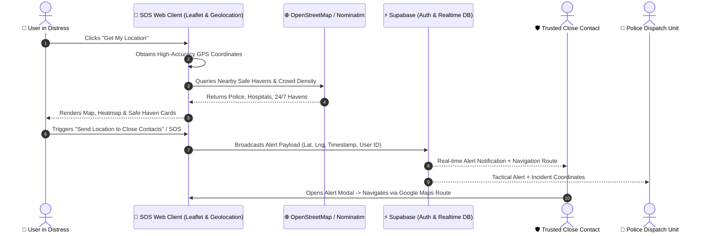

# 🛡️ SOS Safety System & SENTINEL Command Portal

[](LICENSE)
[](https://supabase.com)
[](https://leafletjs.com/)
[](#)
[](#)

> **One Platform. Total Protection.** — An integrated, real-time emergency safety and cyber defense ecosystem connecting civilians, trusted emergency contacts, law enforcement dispatch, and security operations centers.

---

## 📑 Table of Contents

- [Overview](#-overview)
- [Key Features & Modules](#-key-features--modules)
  - [1. Role-Based Safety Network (`partbypart/`)](#1-role-based-safety-network-partbypart)
    - [User Portal & Emergency Dashboard](#-user-portal--emergency-dashboard)
    - [Police Tactical Dispatch](#-police-tactical-dispatch)
    - [Close Contact Guardian Network](#-close-contact-guardian-network)
  - [2. SENTINEL Cyber Security Suite (`cyber-login/`)](#2-sentinel-cyber-security-suite-cyber-login)
    - [Threat Intelligence Dashboard](#-threat-intelligence-dashboard)
    - [Admin Command Center](#-admin-command-center)
- [Architecture & Data Flow](#-architecture--data-flow)
- [Tech Stack](#-tech-stack)
- [Project Directory Structure](#-project-directory-structure)
- [Getting Started & Local Setup](#-getting-started--local-setup)
  - [Prerequisites](#prerequisites)
  - [Installation & Setup](#installation--setup)
  - [Environment Variables](#environment-variables)
  - [Running the Application](#running-the-application)
- [Authentication & Security](#-authentication--security)
- [Contributing & License](#-contributing--license)

---

## 🌟 Overview

The **SOS Safety System** is an end-to-end multi-role personal security and incident management platform. Designed for fast emergency response and safety coordination, the system empowers users to broadcast critical GPS location data, find nearby safe havens in real-time, verify trusted emergency guardians, and interface seamlessly with tactical police units and cyber command centers.

### Core Ecosystem Pillars:
1. **Civilian Protection & Emergency Dispatch (`partbypart/`)**: Real-time GPS location broadcasting, crowd density analysis, nearby safe haven discovery, and bidirectional close-contact linking with OTP verification.
2. **Cyber Security & Incident Command (`cyber-login/`)**: Threat telemetry, SOC operator dashboards, administrative overrides, and system health monitoring.

---

## 🚀 Key Features & Modules

### 1. Role-Based Safety Network (`partbypart/`)

The platform provides a dedicated entry point ([`partbypart/index.html`](file:///Users/aryanraghuwanshi/SOS-safety-system/partbypart/index.html)) allowing actors to access their respective specialized portals:

```
                      ┌────────────────────────────┐
                      │  Portal Selector (Hub)     │
                      │  partbypart/index.html     │
                      └─────────────┬──────────────┘
                                    │
         ┌──────────────────────────┼──────────────────────────┐
         ▼                          ▼                          ▼
┌──────────────────┐       ┌──────────────────┐       ┌──────────────────┐
│   User Portal    │       │  Police Network  │       │  Close Contact   │
│  (user-login/ &  │       │ (police-login/)  │       │  (close-contact- │
│    user-home/)   │       │                  │       │     login/)      │
└──────────────────┘       └──────────────────┘       └──────────────────┘
```

---

#### 👤 User Portal & Emergency Dashboard
Located in [`partbypart/user-home/index.html`](file:///Users/aryanraghuwanshi/SOS-safety-system/partbypart/user-home/index.html) and [`partbypart/user-login/`](file:///Users/aryanraghuwanshi/SOS-safety-system/partbypart/user-login/):

- **Multi-Method Secure Login**:
  - Email & Password authentication with real-time error handling.
  - Passwordless Magic Link & Email OTP verification.
  - OAuth 2.0 integration (Google & Apple Sign-In).
  - Split-flap (flip clock) 3D interactive headline animation.
- **Tab 1: "MY" (Live GPS & Safe Haven Radar)**:
  - **High-Precision Geolocation**: Fetches GPS coordinates, tracks accuracy radius, and evaluates environmental crowd density.
  - **Interactive Leaflet Map**: Visualizes live position marker, accuracy buffer circle, and dynamic heatmaps (`leaflet-heat`).
  - **Nearby Safe Haven Finder**: Live querying via OpenStreetMap / Overpass / Nominatim APIs with categorized filters:
    - 🚓 Police Stations
    - 🏥 Hospitals & Emergency Clinics
    - 🏨 Hotels & Accommodations
    - ⛽ 24/7 Gas Stations
    - 🛡️ Safe Havens & Verified Shelters
    - 👥 Crowded Safe Spots
  - **Emergency Action Triggers**:
    - Instant "Open in Google Maps" navigation.
    - One-click "Copy Location Link".
    - 📲 **"Send Location to Close Contacts"** instant SOS alert broadcast.
- **Tab 2: "MY CLOSE ONES" (Trusted Guardian Management)**:
  - Add trusted contacts with **6-digit OTP verification code** flow.
  - Active trusted contacts list with quick emergency communication tools.
- **Tab 3: "SEE YOUR CLOSE ONES" (Reverse Safety Network)**:
  - Displays users who have designated you as their guardian.
  - **Received Location Alert Modal**: Shows sender details, timestamp, live interactive map, and automated route planning / turn-by-turn navigation buttons.

---

#### 🚓 Police Tactical Dispatch
Located in [`partbypart/police-login/`](file:///Users/aryanraghuwanshi/SOS-safety-system/partbypart/police-login/):

- Dedicated command login portal for law enforcement personnel.
- Incident response interface for receiving incoming SOS distress signals, live victim coordinates, and precinct tactical coordination.

---

#### 👥 Close Contact Guardian Network
Located in [`partbypart/close-contact-login/`](file:///Users/aryanraghuwanshi/SOS-safety-system/partbypart/close-contact-login/):

- Portal for family members and designated emergency guardians.
- Access to linked user status, real-time alert logs, and direct dispatch coordination.

---

### 2. SENTINEL Cyber Security Suite (`cyber-login/`)

A high-tech, futuristic dark-cyber security command portal built for operations and administration:

- **Cyber Access Gate ([`cyber-login/index.html`](file:///Users/aryanraghuwanshi/SOS-safety-system/cyber-login/index.html))**: Dynamic grid background, corner-bracket aesthetics, and role switching between SOC User and System Admin.
- **Threat Intelligence Dashboard ([`cyber-login/dashboard.html`](file:///Users/aryanraghuwanshi/SOS-safety-system/cyber-login/dashboard.html))**:
  - Live system telemetry: Active Nodes (`US-EAST-SOC-1`), Encryption (`AES-256 GCM`), and Session Monitor.
  - Metrics cards (threat levels, incident status, uptime indicators).
  - Integrated terminal simulation stream.
- **Admin Command Center ([`cyber-login/admin-dashboard.html`](file:///Users/aryanraghuwanshi/SOS-safety-system/cyber-login/admin-dashboard.html))**:
  - Elevated permissions management.
  - System controls, user authorization rosters, and audit logging.

---

## 🔄 Architecture & Data Flow



---

## 💻 Tech Stack

| Layer | Technologies |
|---|---|
| **Frontend Core** | HTML5, CSS3 (Custom Glassmorphism, CSS Grid/Flexbox, Dark Themes), Vanilla JavaScript (ES6+) |
| **Animation & UI** | 3D Split-Flap Flip Cards, Cyber Grid & Scanning Lines, Micro-Interactions |
| **Maps & Geospatial** | [Leaflet.js v1.9.4](https://leafletjs.com/), [Leaflet Heat](https://github.com/Leaflet/Leaflet.heat), OpenStreetMap Tiles, Nominatim API |
| **Backend as a Service** | [Supabase](https://supabase.com/) (PostgreSQL, Supabase Auth, Row Level Security, Realtime Subscriptions) |
| **External Integrations** | Google Maps Universal URLs, Nominatim Reverse Geocoding, Overpass API |

---

## 📁 Project Directory Structure

```text
SOS-safety-system/
├── .env.example                 # Template for environment configuration
├── LICENSE                      # MIT License
├── README.md                    # Project documentation
│
├── partbypart/                  # Core Safety & SOS Application
│   ├── index.html               # Main Role Selection Portal (User / Police / Contact)
│   ├── role-selection.css       # Styling for Role Selection Hub
│   ├── style.css                # Base stylesheet
│   ├── script.js                # Role switcher interactions
│   │
│   ├── user-login/              # Civilian User Authentication
│   │   ├── index.html           # Login & Sign-Up Interface
│   │   ├── style.css            # Split-flap & login aesthetics
│   │   ├── script.js            # Auth controller (Password, OTP, OAuth)
│   │   └── supabaseClient.js    # Supabase Client initializations
│   │
│   ├── user-home/               # Primary Emergency & Safety Dashboard
│   │   └── index.html           # Full SPA containing "MY", "MY CLOSE ONES", & "SEE YOUR CLOSE ONES"
│   │
│   ├── police-login/            # Law Enforcement Tactical Portal
│   │   ├── index.html           # Police Dispatch login interface
│   │   ├── style.css            # Tactical theme styling
│   │   └── script.js            # Police login authentication logic
│   │
│   └── close-contact-login/     # Guardian / Trusted Contact Portal
│       ├── index.html           # Close contact login interface
│       ├── style.css            # Guardian theme styling
│       └── script.js            # Contact login logic
│
└── cyber-login/                 # SENTINEL Cyber Threat & Admin Command Suite
    ├── index.html               # Cyber Access Portal (User vs. Admin selection)
    ├── login.css                # Cyberpunk / High-Tech SOC dark theme
    ├── login.js                 # Cyber auth state controller
    ├── user-login.html          # Cyber user login view
    ├── dashboard.html           # Threat Intelligence & SOC Telemetry Dashboard
    ├── admin-login.html         # Administrator authentication portal
    ├── admin-dashboard.html     # Admin Command Center & authorization controls
    └── admin.js                 # Admin dashboard event controller
```

---

## 🛠️ Getting Started & Local Setup

### Prerequisites

- A modern web browser (Google Chrome, Firefox, Safari, or Edge) with Geolocation API support enabled.
- A local web server tool (VS Code Live Server extension, Python `http.server`, Node `npx serve`, or Vite).
- A [Supabase](https://supabase.com/) project account (optional if using default demo environment).

### Installation & Setup

1. **Clone the repository**:
   ```bash
   git clone https://github.com/Aryanraghuwanshi7/SOS-safety-system.git
   cd SOS-safety-system
   ```

2. **Configure Environment Variables**:
   Copy `.env.example` to `.env` and fill in your Supabase project credentials:
   ```bash
   cp .env.example .env
   ```

   ```env
   VITE_SUPABASE_URL=https://your-project-id.supabase.co
   VITE_SUPABASE_PUBLISHABLE_KEY=your-supabase-publishable-key
   ```

3. **Running the Application**:
   Because the system uses modern ES modules and Geolocation APIs, run the project with a local development server:

   **Option A: Using Python 3 HTTP Server**
   ```bash
   python3 -m http.server 8000
   ```
   Then open `http://localhost:8000/partbypart/index.html` in your browser.

   **Option B: Using Node `serve` or `npx`**
   ```bash
   npx serve .
   ```

   **Option C: Using VS Code Live Server**
   - Right click on [`partbypart/index.html`](file:///Users/aryanraghuwanshi/SOS-safety-system/partbypart/index.html) and select **"Open with Live Server"**.

---

## 🔒 Authentication & Security

- **Session Persistence**: Sessions are managed with Supabase Auth JS SDK (`supabase.auth.getSession()` & `onAuthStateChange`).
- **Route Guarding**: Protected pages (e.g. `user-home/index.html`, `cyber-login/dashboard.html`, `cyber-login/admin-dashboard.html`) automatically verify authentication state and redirect unauthenticated users to the login screen.
- **Passwordless Verification**: Built-in 6-digit OTP code verification for emergency guardian linking prevents unauthorized access and spoofing.
- **HTTPS / Geolocation Requirement**: Geolocation APIs require a secure context (`https://` or `localhost`).

---

## 🤝 Contributing

Contributions, issues, and feature requests are welcome!

1. Fork the Project
2. Create your Feature Branch (`git checkout -b feature/AmazingFeature`)
3. Commit your Changes (`git commit -m 'Add some AmazingFeature'`)
4. Push to the Branch (`git push origin feature/AmazingFeature`)
5. Open a Pull Request

---

## 📄 License

Distributed under the **MIT License**. See [`LICENSE`](file:///Users/aryanraghuwanshi/SOS-safety-system/LICENSE) for more information.

---

<div align="center">
  <sub>Built with ❤️ for public safety, rapid emergency dispatch, and secure digital defense.</sub>
</div>